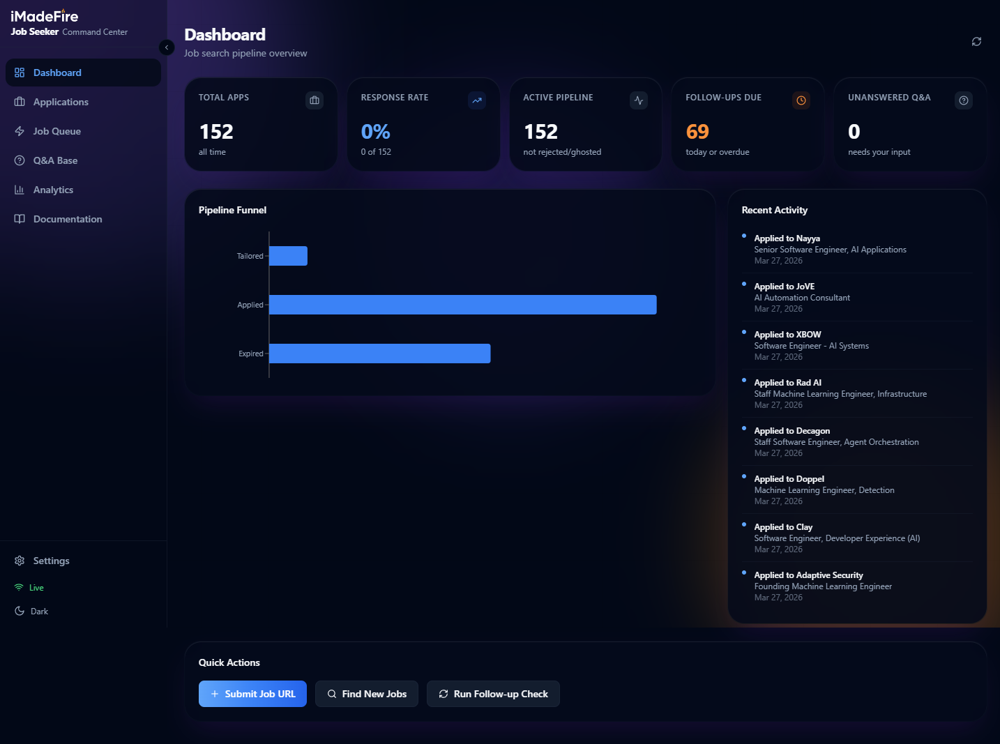
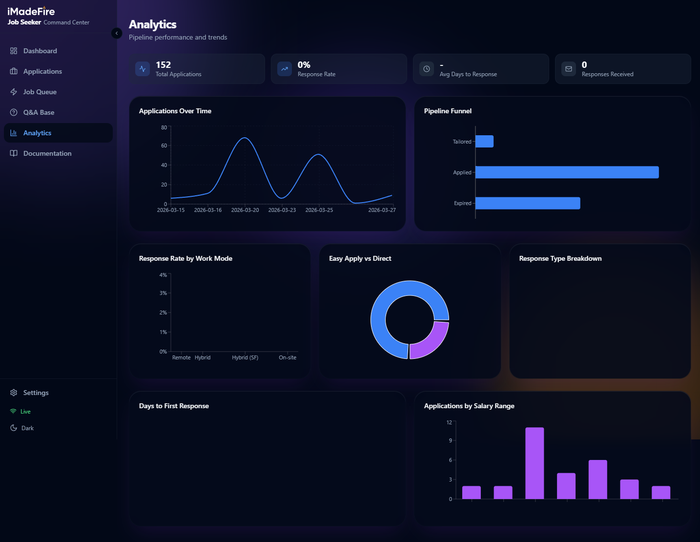
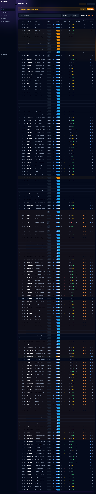
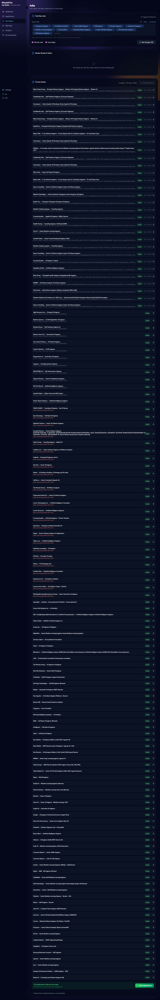
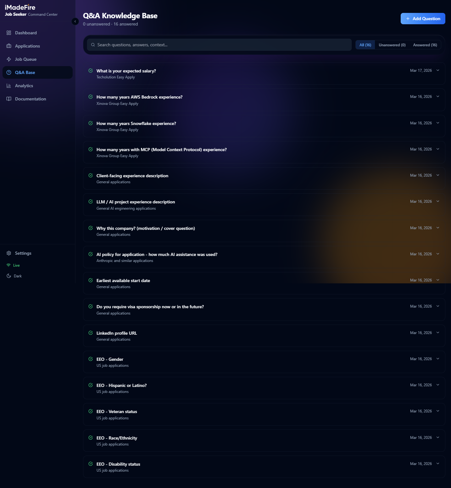

# Job Seeker: AI-Powered Job Search Pipeline

## Overview

Job Seeker is a full-stack AI-assisted job search pipeline that automates the end-to-end application process: discovering relevant roles, tailoring resumes to each job description with Claude AI, submitting applications through LinkedIn Easy Apply and ATS portals, and tracking every application through a professional web-based Command Center.

The system was built for a Principal AI Engineer actively job hunting, targeting remote and NYC-metro AI/ML roles. The problem it solves is straightforward: applying to 150+ jobs manually, each with a custom-tailored resume, would take weeks of repetitive work. This pipeline compresses that to hours, while producing higher-quality applications than a human could at that volume.

The end user is the job seeker (sole operator), but the architecture is designed to be reusable for any candidate willing to provide their resume, API key, and LinkedIn session.

## Business Impact / Key Outcomes

Within two weeks of deployment, the pipeline produced measurable results:

- **152 applications submitted** across 100+ companies, each with a uniquely tailored resume
- **179 tailored resume packages generated**, each containing a customized resume (MD, HTML, PDF), cover letter, and full JD analysis with ATS keyword mapping
- **16 application questions auto-answered** from a growing knowledge base, eliminating repetitive form-filling
- **Hours of manual work eliminated per application** — what took 30-45 minutes per job (read JD, rewrite resume, format, apply) now takes under 2 minutes end-to-end

Key capabilities delivered:

- AI-powered resume tailoring that rewrites experience bullets to match JD language and ATS keywords
- LinkedIn scraping with Claude-scored fit ratings (1-5 scale) for rapid triage
- Browser automation for LinkedIn Easy Apply and external ATS portals (Greenhouse, Lever, Ashby, Workday)
- Semantic Q&A matching that remembers answers across applications and auto-fills them
- Real-time Command Center dashboard with pipeline funnel, activity feed, and analytics
- Application follow-up tracking with automated reminders

## Architecture / Technical Approach

The system is split into two layers: a **Python pipeline** for AI processing and browser automation, and a **Next.js Command Center** for management and visualization.

**Pipeline layer** (Python): The core workflow is `discover → tailor → submit → track`. The LinkedIn scraper uses Playwright with a persistent browser profile to search for jobs matching configurable criteria (role titles, location, remote/Easy Apply filters). Each job card is extracted and scored by Claude Haiku against the candidate's profile. Selected jobs are queued for processing.

The tailoring engine sends the full job description to Claude Opus, which produces a comprehensive analysis: match score (0-100), ATS keyword coverage (before and after), skill gaps, and recommended angles. It then rewrites the candidate's base resume to mirror the JD's language, prioritize relevant experience, and maximize ATS keyword density. Output is a 7-file package per job (resume in MD/HTML/PDF, cover letter, analysis JSON, JD, and posting metadata).

Submission uses Playwright to automate LinkedIn Easy Apply flows (multi-page forms, file uploads, EEO questions) and external ATS portals. A modular ATS system fingerprints the portal type and applies platform-specific field mapping and injection strategies.

**Command Center** (Next.js 14): A locally-hosted web UI that reads the pipeline's CSV and JSON files directly (no database). A custom Node.js server wraps Next.js with WebSocket support for real-time updates and a file watcher that triggers UI refreshes when pipeline output changes. Authentication uses HTTP Basic Auth via middleware.

**Data flow:** Pipeline scripts write to CSV/JSON files in the `jobs/` and `applications/` directories. The Command Center's API routes read these files on each request. WebSocket pushes notify the UI when files change, keeping the dashboard current during active pipeline runs.

## Tech Stack

- **Frontend:** Next.js 14 (App Router), TypeScript, Tailwind CSS, shadcn/ui, Recharts, SWR
- **Backend:** Node.js (custom server with WebSocket), Python 3.11+
- **AI:** Claude API (Opus for analysis/tailoring, Haiku for scoring), Anthropic SDK
- **Automation:** Playwright (browser automation, LinkedIn, ATS portals)
- **Data:** File-based (CSV for tracking, JSON for queues, Markdown for resumes)
- **Infrastructure:** Local development server, WebSocket for real-time updates
- **Other:** python-docx (Word export), Chrome DevTools Protocol (PDF generation), here.now (file sharing)

## Design

The Command Center uses a dark-first glassmorphic design system built on Tailwind CSS with custom design tokens.

Key design decisions:

- **Dark mode default** — optimized for extended use during job search sessions
- **Glassmorphic cards** with `backdrop-blur` and animated spotlight effects for visual depth
- **Ambient background** with three independently animated gradient orbs (22s, 28s, 35s cycles) creating a subtle lava-lamp effect
- **KPI dashboard pattern** — five metric cards at the top of the dashboard provide at-a-glance pipeline health
- **Pipeline funnel visualization** — horizontal bar chart showing application status distribution (Tailored → Applied → Expired)
- **Inline actions** — status changes, follow-up dates, and notes are editable directly in the applications table without navigating away

## Challenges & Solutions

**ATS Form Diversity:** Every ATS platform (Greenhouse, Lever, Ashby, Workday, iCIMS) structures its forms differently, uses different field names, and handles dropdowns/comboboxes with different JavaScript patterns.
*Solution:* Built a modular ATS detection and filling system. A fingerprinting module identifies the ATS from URL patterns and page structure. Platform-specific modules handle field mapping, with fallback strategies: batch JS injection → Playwright native `fill()` → label-based matching → keyboard navigation for comboboxes.

**LinkedIn EEO Radio Buttons:** LinkedIn's custom radio button components in Easy Apply forms didn't respond to standard JavaScript click events, causing applications to stall at the review stage.
*Solution:* Switched from JS `el.click()` to Playwright native `.click(force=True)` on the underlying `input[type='radio']` elements, with fieldset-based grouping to identify Gender, Disability, and Race/Ethnicity sections and select appropriate responses.

**Resume Quality at Scale:** Generating 150+ tailored resumes risks producing generic, template-feeling output that defeats the purpose of customization.
*Solution:* The tailoring prompt enforces strict formatting rules (no em dashes, specific section headers, company entry format) and requires the AI to rewrite experience bullets using exact phrases from the JD. A post-analysis step calculates ATS keyword coverage before and after tailoring, providing a measurable quality signal visible in the Command Center.

**Real-Time UI Without a Database:** The pipeline writes CSV and JSON files, but the Command Center needs to reflect changes immediately during active pipeline runs.
*Solution:* A custom Node.js server wraps Next.js with a WebSocket layer and `fs.watch` on the data files. When the pipeline writes to `application_tracker.csv` or `job_queue.json`, the file watcher triggers a WebSocket broadcast, and the UI refreshes via SWR revalidation.

**Semantic Q&A Matching:** Application forms ask the same questions in slightly different ways ("What is your expected salary?" vs. "Salary expectations?" vs. "Desired compensation range"). Exact string matching misses most of these.
*Solution:* A three-tier matching engine: exact match → keyword overlap scoring → Claude semantic similarity. Previously answered questions are stored in a CSV knowledge base with context tags. When a new question appears, the matcher finds the closest existing answer and auto-fills it, with a confidence threshold that flags uncertain matches for human review.

## Media & Documents

### Dashboard
The main dashboard provides a pipeline overview with KPI cards, a status funnel chart, recent activity feed, and quick action buttons.

### Applications Table
A filterable, sortable table of all 152+ applications with inline status management, match scores, and ATS coverage metrics.

### Job Discovery
A three-step workflow: search LinkedIn with configurable titles and filters, review AI-scored results, then queue selected jobs for tailoring.

### Q&A Knowledge Base
Questions encountered during applications are stored with answers for reuse. The semantic matcher auto-fills future forms using this growing knowledge base.

### Analytics
Pipeline performance charts including application volume over time, funnel distribution, response rates by work mode, and salary range distribution.

## Future Enhancements

- **Multi-platform scraping** — Expand beyond LinkedIn to Wellfound, Built In, and HN Who's Hiring with unified scoring
- **Response tracking automation** — Monitor email inbox for recruiter responses and auto-update application status
- **Interview prep module** — Generate company-specific interview prep materials from the JD analysis and tailored resume
- **Mobile-responsive Command Center** — Adapt the UI for phone-sized screens for on-the-go status checks
- **Collaborative mode** — Support multiple candidate profiles for career coaches or agencies managing several job seekers
